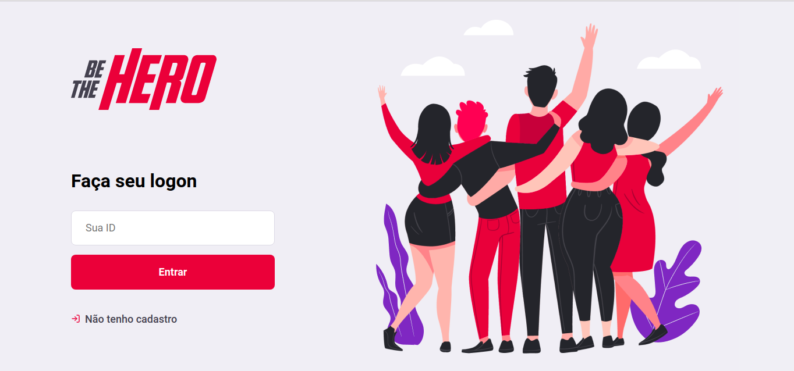

  <a  href="#what-it-is">What it is</a>&nbsp;&nbsp;&nbsp;|&nbsp;&nbsp;&nbsp;
  <a href="#technologies">Technologies</a>&nbsp;&nbsp;&nbsp;|&nbsp;&nbsp;&nbsp;
  <a href="#the-idea">Project Idea</a>&nbsp;&nbsp;&nbsp;|&nbsp;&nbsp;&nbsp;
  <a href="#preview">Preview</a>&nbsp;&nbsp;&nbsp;|&nbsp;&nbsp;&nbsp;
  <a href="#author">Author</a>&nbsp;&nbsp;&nbsp;|&nbsp;&nbsp;&nbsp;
  <a href="#inspired-by">Inspired By</a>

 

---

## What it is
Be The Hero is a project developed during the "Semana Omnistack 11.0" provided by, [@Rocketseat](https://github.com/Rocketseat) where I learned to use the stack [Node](https://nodejs.org/en/), [React](https://reactjs.org/), [React Native](https://reactnative.dev/) and a lot of other technologies in this ecosytem to implement a rest api that provided the data and bisiness rules for the frontend and the mobile aplication.

---

## :building_construction: Technologies

This project uses the following technologies:

-    
    <a style="color:#539E43;" href="https://nodejs.org/en/">Node
    </a>

-    
    <a style="color:#53C1DE;" href="https://reactjs.org">React
    </a>

-    
    <a style="color:#4b69a6" href="https://facebook.github.io/react-native/">React Native
    </a>
    
also: 
  - [Express](https://expressjs.com/pt-br/)
  - [KnexJS](http://knexjs.org/)
  - [Expo](https://expo.io/)
  - [Axios](https://github.com/axios/axios)
  - [SQLite](https://www.sqlite.org/index.html)
  - [Celebrate](https://www.npmjs.com/package/celebrate)
  - [Jest](https://jestjs.io/)

---
## :rocket: The Idea

** Be The Hero ** is a platform that connects NGOs and people.
It allows NGOs to report incidents that they are working on, so that Heroes can get in touch and help with costs as well as better understand the work of NGOs in the community. 

---
## :computer: Preview
---

## :bust_in_silhouette: Athor
Edmundo Ribeiro : @Edmundo-Ribeiro

---

## :busts_in_silhouette: Inspired By

All the code developet here was inspired by the lectures promoted by @Rocketseat and @diego3g