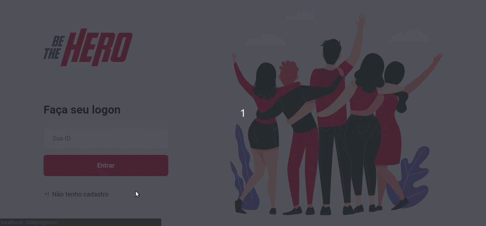

<h1 align="center">

</h1>

  <a  href="#question-what-it-is">What it is</a>&nbsp;&nbsp;&nbsp;|&nbsp;&nbsp;&nbsp;
  <a href="#wrench-technologies">Technologies</a>&nbsp;&nbsp;&nbsp;|&nbsp;&nbsp;&nbsp;
  <a href="#rocket-the-idea">Project Idea</a>&nbsp;&nbsp;&nbsp;|&nbsp;&nbsp;&nbsp;
  <a href="#computer-preview">Preview</a>&nbsp;&nbsp;&nbsp;|&nbsp;&nbsp;&nbsp;
  <a href="#author">Author</a>&nbsp;&nbsp;&nbsp;|&nbsp;&nbsp;&nbsp;
  <a href="#inspired-by">Inspired By</a>

 

  

  

  

---

## :question: What it is
Be The Hero is a project developed during the "Semana Omnistack 11.0" hosted by [@Rocketseat](https://github.com/Rocketseat) in which I learned how to use the stack [Node](https://nodejs.org/en/), [React](https://reactjs.org/), [React Native](https://reactnative.dev/) and several other technologies in this ecosystem. The result was a REST API which provides data and contains the business rules consumed by a frontend for web and mobile.

<h2 align="center">

</h2>

## :wrench: Technologies

This project uses the following technologies:

-    
    <a style="color:#539E43;" href="https://nodejs.org/en/">Node
    </a>

-    
    <a style="color:#53C1DE;" href="https://reactjs.org">React
    </a>

-    
    <a style="color:#4b69a6" href="https://facebook.github.io/react-native/">React Native
    </a>
    
also: 
  - [Express](https://expressjs.com/pt-br/)
  - [KnexJS](http://knexjs.org/)
  - [Expo](https://expo.io/)
  - [Axios](https://github.com/axios/axios)
  - [SQLite](https://www.sqlite.org/index.html)
  - [Celebrate](https://www.npmjs.com/package/celebrate)
  - [Jest](https://jestjs.io/)

---
## :rocket: The Idea

**Be The Hero** is a platform that connects NGOs and people.
It allows NGOs to report incidents that they are working on, so that Heroes can get in touch and help with costs as well as better understand the work of NGOs in the community. 

---
## :computer: Preview
<h4 align="center"> Registration and Logon</h4>

<h4 align="center">Register a new issue and Logout</h4>

---

## Author
Edmundo Ribeiro : [@Edmundo-Ribeiro](https://github.com/Edmundo-Ribeiro)

---

## Inspired By

All the code developed here was inspired by the lectures promoted by [@Rocketseat](https://github.com/Rocketseat) and [@diego3g](https://github.com/diego3g).